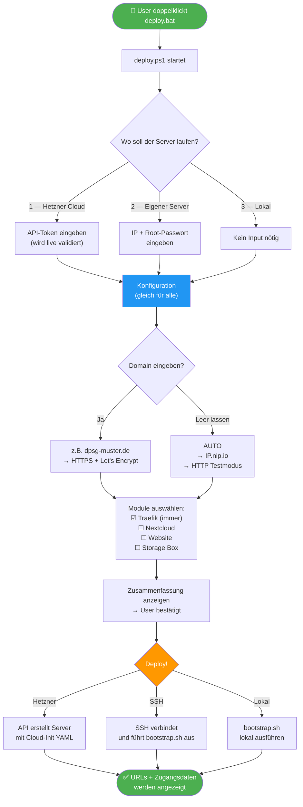
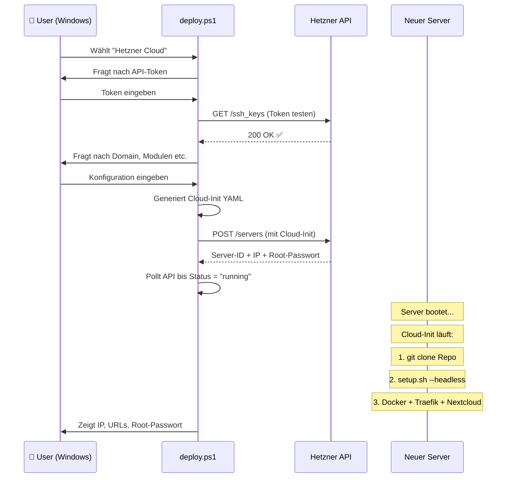
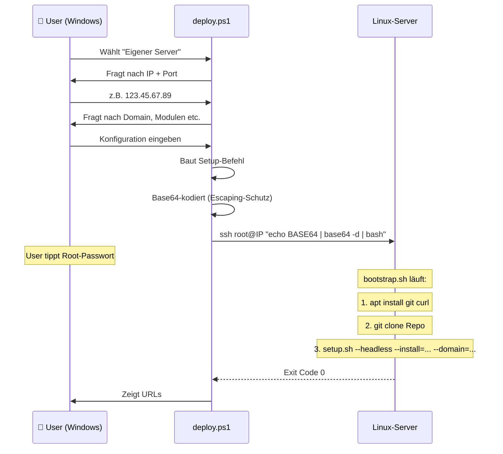
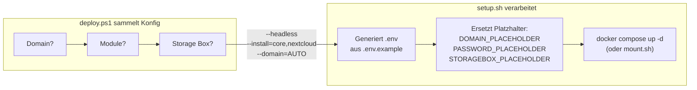
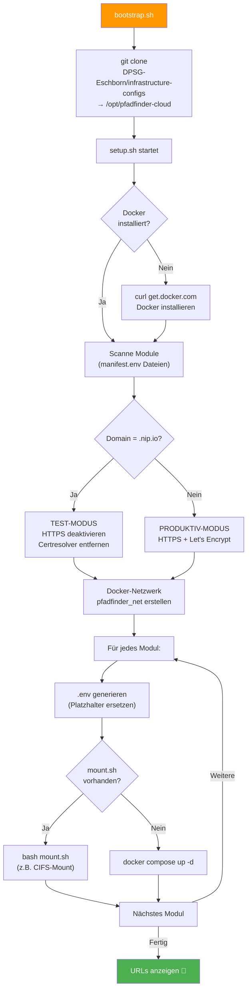
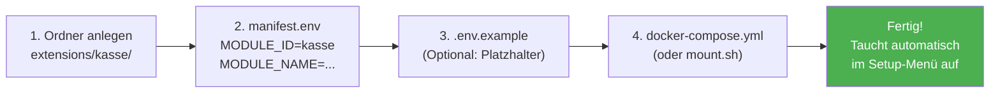

# 🏕️ Pfadfinder-Cloud — Architektur & User-Flow

Diese Seite erklärt den gesamten Ablauf: Vom Doppelklick auf `deploy.bat` bis zum laufenden Server.

---

## Der große Überblick



---

## Phase 1: Einstieg — Was der User sieht

Der User braucht nur zwei Dateien:

- **`deploy.bat`** — Das klickt der User an (Windows-Einstiegspunkt)
- **`deploy.ps1`** — Das führt die eigentliche Arbeit aus

`deploy.bat` ruft PowerShell mit `ExecutionPolicy Bypass` auf, damit keine Policy-Probleme entstehen. Der User muss **nichts installieren** — PowerShell und SSH sind seit Windows 10 eingebaut.

---

## Phase 2: Provider-Auswahl — Die 3 Wege

### Weg 1: Hetzner Cloud (Vollautomat)



**Was der User eingeben muss:**

1. Hetzner API-Token (5 Klicks in der Hetzner Console)
2. Optional: GitHub-Username (für SSH-Zugang)
3. Domain (oder leer für Testmodus)
4. Module auswählen (y/n pro Modul)

### Weg 2: Eigener Server (SSH)



**Was der User eingeben muss:**

1. IP-Adresse des Servers
2. Root-Passwort (im SSH-Prompt)
3. Domain + Module (wie oben)

### Weg 3: Lokal (Homeserver / Raspberry Pi)

Identisch zu Weg 2, aber ohne SSH. Das Skript läuft direkt auf dem Linux-Server. Nur sinnvoll wenn der User am Server-Terminal selbst sitzt.

---

## Phase 3: Konfiguration — Was passiert im Detail



### Das Platzhalter-System

So werden aus Templates echte Konfigurationen:

```text
.env.example (Template)               .env (Generiert)
─────────────────────────             ──────────────────────────
DOMAIN_NAME=DOMAIN_PLACEHOLDER    →   DOMAIN_NAME=dpsg-muster.de
DB_PASSWORD=PASSWORD_PLACEHOLDER  →   DB_PASSWORD=a7f3b2c9e8d1...
NEXTCLOUD_DATA_DIR=nextcloud_...  →   NEXTCLOUD_DATA_DIR=/mnt/storagebox-data
```

| Platzhalter | Wird ersetzt durch | Woher kommt der Wert? |
| --- | --- | --- |
| `DOMAIN_PLACEHOLDER` | Domain oder IP.nip.io | User-Eingabe oder AUTO-Erkennung |
| `PASSWORD_PLACEHOLDER` | Zufällig generiert (32 Zeichen hex) | `openssl rand -hex 16` |
| `STORAGEBOX_PLACEHOLDER` | z.B. `u123456` | User-Eingabe im Dialog |
| `STORAGEBOXPW_PLACEHOLDER` | Storage-Box-Passwort | User-Eingabe (verdeckt) |

---

## Phase 4: Deployment — Was auf dem Server passiert



---

## Die Modul-Reihenfolge

Die Reihenfolge ist wichtig — Module werden in der Install-Reihenfolge gestartet:

| # | Modul | Typ | Was es macht |
| --- | --- | --- | --- |
| 1 | `core` (Traefik) | docker-compose | Reverse Proxy + SSL-Zertifikate |
| 2 | `storagebox` | mount.sh | CIFS-Mount der Hetzner Storage Box |
| 3 | `nextcloud` | docker-compose | Cloud-Speicher + MariaDB Datenbank |
| 4 | `website` | docker-compose | Statische Stammes-Homepage |

> **Warum diese Reihenfolge?**
>
> - Traefik muss zuerst laufen (andere Module registrieren sich dort per Docker-Labels)
> - Storage Box muss vor Nextcloud gemountet sein (Nextcloud braucht den Mount-Pfad beim Start)

---

## Datei-Architektur — Was gehört wohin

```text
infrastructure-configs/
│
├── deploy.bat                 ← USER KLICKT HIER
├── deploy.ps1                 ← Windows-Wizard (Provider-Auswahl + Konfig)
│
├── bootstrap.sh               ← Auf dem SERVER: klont Repo + startet setup.sh
├── setup.sh                   ← Auf dem SERVER: die eigentliche Deployment-Engine
│
├── cloud-configs/
│   └── hetzner-basic-node.yaml    ← Cloud-Init Template (manuelle Alternative)
│
├── core/
│   └── traefik/               ← MUSS immer installiert werden
│       ├── manifest.env           (Plugin-Metadaten)
│       ├── .env.example           (Template: Domain)
│       └── docker-compose.yml     (Container-Definition)
│
└── extensions/
    ├── nextcloud/             ← Optionales Modul: Cloud-Speicher
    │   ├── manifest.env
    │   ├── .env.example           (Template: Domain, DB-Passwort, Data-Dir)
    │   └── docker-compose.yml
    │
    ├── storagebox/            ← Optionales Modul: Hetzner Storage Box
    │   ├── manifest.env
    │   ├── .env.example           (Template: SB-User, SB-Passwort)
    │   └── mount.sh               (KEIN Docker — Host-Level CIFS-Mount)
    │
    └── website/               ← Optionales Modul: Homepage
        ├── manifest.env
        ├── .env.example           (Template: Domain)
        ├── docker-compose.yml
        └── html/index.html
```

---

## Neues Modul hinzufügen

Wenn jemand ein neues Plugin bauen will (z.B. eine Kassen-Software), sind nur 3 Dateien nötig:



**Kein Code in `setup.sh` ändern nötig** — das Manifest wird beim nächsten Start automatisch erkannt.

Eine ausführliche Anleitung dazu steht in [Plugin-Entwicklung](./plugin-entwicklung.md).
