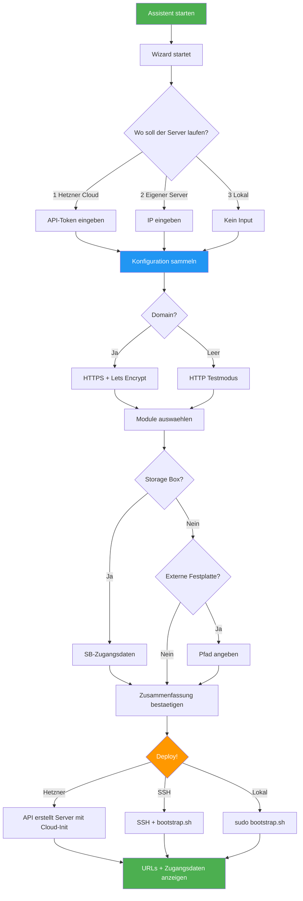
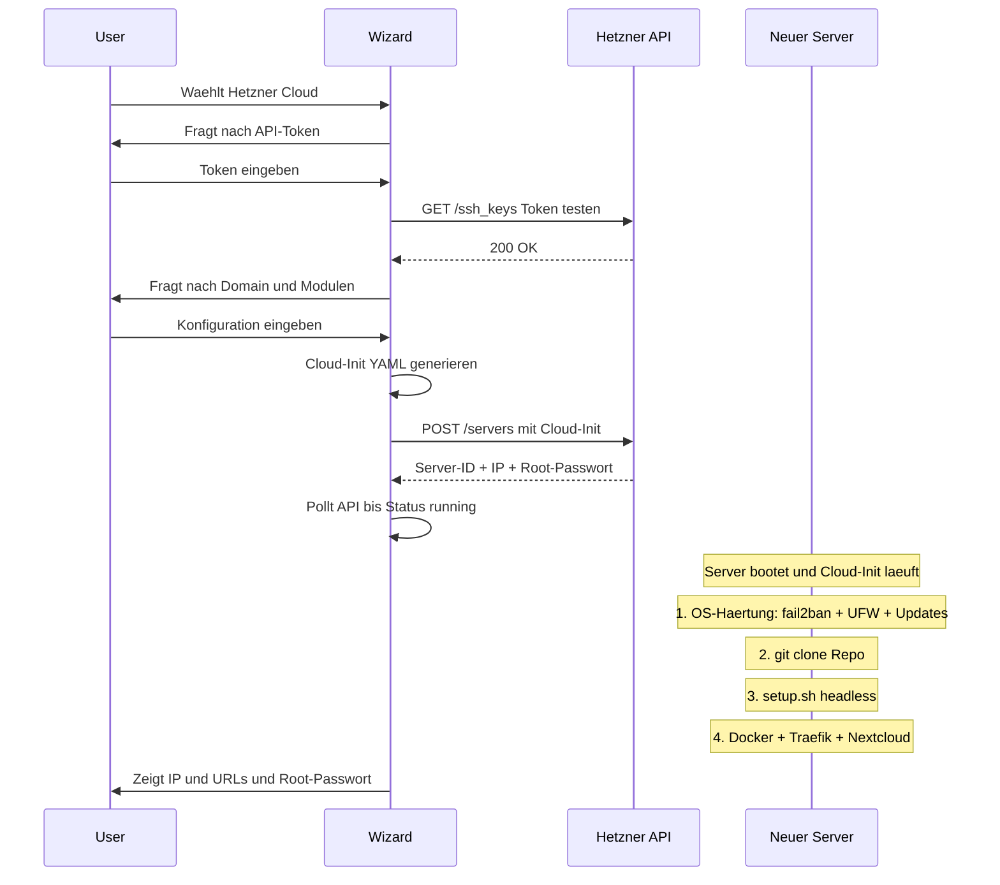
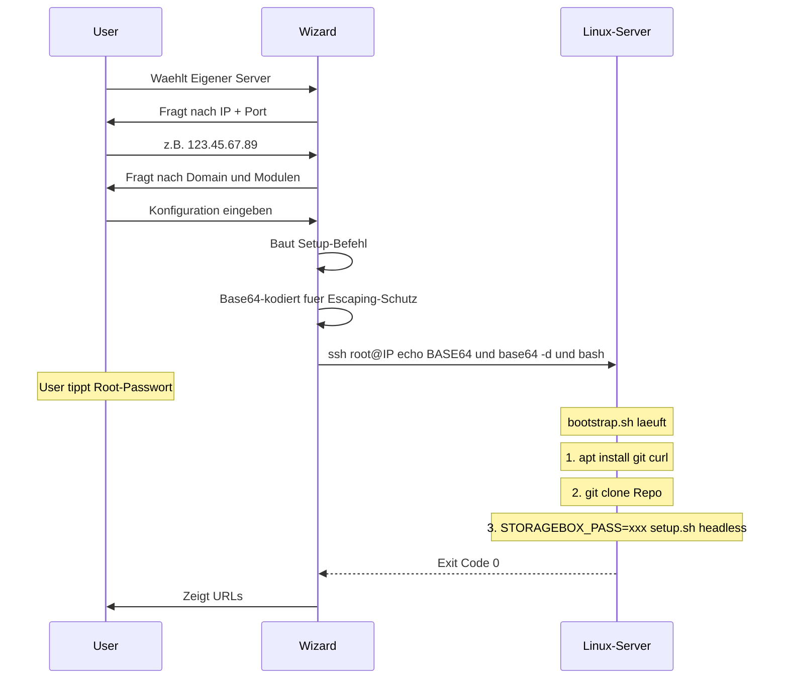
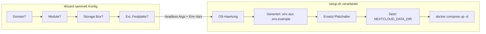
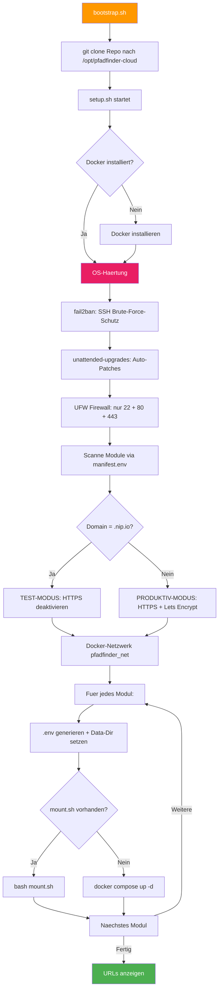
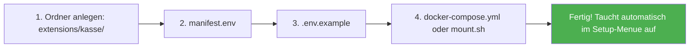

# 🏕️ Pfadfinder-Cloud — Architektur & User-Flow

Diese Seite erklärt den gesamten Ablauf: Vom Start des Assistenten bis zum laufenden Server.

---

## Der große Überblick



---

## Phase 1: Einstieg — Drei Wege zum Assistenten

Der Assistent ist auf **jedem Betriebssystem** aufrufbar:

| Betriebssystem | Einstieg | Datei |
| --- | --- | --- |
| **Windows** (Option A) | `deploy.bat` herunterladen + Doppelklick | `deploy.bat` lädt `deploy.ps1` automatisch von GitHub |
| **Windows** (Option B) | PowerShell-Einzeiler | `irm URL -OutFile ...; & ...` |
| **Linux / macOS** | Terminal-Einzeiler | `curl -sL URL -o /tmp/deploy.sh && bash /tmp/deploy.sh` |
| **Direkt am Server** | Terminal | `sudo ./setup.sh --interactive` |

> **Hinweis:** `deploy.bat` ist standalone — es enthält keinen Code, sondern lädt `deploy.ps1` bei jeder Ausführung frisch von GitHub herunter. So ist der Assistent immer auf dem neuesten Stand.

---

## Phase 2: Provider-Auswahl — Die 3 Wege

### Weg 1: Hetzner Cloud (Vollautomat)



**Was der User eingeben muss:**

1. Hetzner API-Token (5 Klicks in der Hetzner Console)
2. Optional: GitHub-Username (für SSH-Zugang per Key)
3. Domain (oder leer für Testmodus)
4. Module auswählen (y/n pro Modul)
5. Optional: Storage Box oder externe Festplatte

### Weg 2: Eigener Server (SSH)



> **Sicherheit:** Das StorageBox-Passwort wird als **Environment-Variable** übergeben (`STORAGEBOX_PASS='...' ./setup.sh`), nicht als CLI-Argument. Dadurch ist es weder in `ps aux` noch in Logfiles sichtbar.

### Weg 3: Lokal (Homeserver / Raspberry Pi)

Identisch zu Weg 2, aber ohne SSH. Das Skript erkennt automatisch ob Root-Rechte vorhanden sind und fragt bei Bedarf nach dem `sudo`-Passwort. Nur sinnvoll wenn der User direkt am Server-Terminal sitzt.

---

## Phase 3: Konfiguration — Was passiert im Detail



### Das Platzhalter-System

So werden aus Templates echte Konfigurationen:

```text
.env.example (Template)               .env (Generiert)
─────────────────────────             ──────────────────────────
DOMAIN_NAME=DOMAIN_PLACEHOLDER    →   DOMAIN_NAME=dpsg-muster.de
DB_PASSWORD=PASSWORD_PLACEHOLDER  →   DB_PASSWORD=a7f3b2c9e8d1...
NEXTCLOUD_DATA_DIR=nextcloud_...  →   NEXTCLOUD_DATA_DIR=/mnt/storagebox-data
```

| Platzhalter | Wird ersetzt durch | Woher kommt der Wert? |
| --- | --- | --- |
| `DOMAIN_PLACEHOLDER` | Domain oder IP.nip.io | User-Eingabe oder AUTO-Erkennung |
| `PASSWORD_PLACEHOLDER` | Zufällig generiert (32 Zeichen hex) | `openssl rand -hex 16` |
| `STORAGEBOX_PLACEHOLDER` | z.B. `u123456` | User-Eingabe im Dialog |
| `STORAGEBOXPW_PLACEHOLDER` | Storage-Box-Passwort | User-Eingabe (verdeckt) |

### Nextcloud Data-Directory

Das Datenverzeichnis wird **während der .env-Generierung** gesetzt (nicht nachträglich). Priorität:

1. **StorageBox aktiv** → `/mnt/storagebox-data`
2. **Externe Festplatte** → `/mnt/nextcloud-data` (oder `--data-dir` Pfad)
3. **Nichts konfiguriert** → Standard (`nextcloud_userdata` Docker-Volume)

---

## Phase 4: Deployment — Was auf dem Server passiert



---

## Die Modul-Reihenfolge

Die Reihenfolge ist wichtig — Module werden in der Install-Reihenfolge gestartet:

| # | Modul | Typ | Was es macht |
| --- | --- | --- | --- |
| 1 | `core` (Traefik) | docker-compose | Reverse Proxy + SSL-Zertifikate + Security-Headers |
| 2 | `storagebox` | mount.sh | CIFS-Mount der Hetzner Storage Box |
| 3 | `nextcloud` | docker-compose | Cloud-Speicher + MariaDB Datenbank |
| 4 | `website` | docker-compose | Statische Stammes-Homepage |

> **Warum diese Reihenfolge?**
>
> - Traefik muss zuerst laufen (andere Module registrieren sich dort per Docker-Labels)
> - Storage Box muss **vor** Nextcloud gemountet sein (Nextcloud braucht den Mount-Pfad beim Start)
> - Nextcloud Data-Dir wird **bei der .env-Generierung** gesetzt, nicht nachträglich

---

## Sicherheits-Architektur

Jeder Server wird automatisch gehärtet — sowohl über Cloud-Init (Hetzner) als auch durch setup.sh (alle Provider):

| Maßnahme | Implementierung | Schutz gegen |
| --- | --- | --- |
| **fail2ban** | SSH-Jail, automatische IP-Sperre | Brute-Force-Angriffe |
| **UFW Firewall** | deny-all + Whitelist 22/80/443 | Port-Scanning, unerwünschter Zugriff |
| **unattended-upgrades** | Automatische Sicherheitspatches | Bekannte Schwachstellen |
| **SSH-Härtung** | Root-Login verboten, Max. 3 Versuche | SSH-Brute-Force |
| **Security-Headers** | HSTS, X-Frame-Options, CSP via Traefik | XSS, Clickjacking |
| **Passwort-Handling** | Env-Vars statt CLI-Args, `openssl rand` | Klartext-Leaks in Logs/Prozessliste |
| **Atomic Writes** | .env wird in .env.tmp geschrieben, dann `mv` | Halb-generierte Konfigurationen |

---

## Datei-Architektur — Was gehört wohin

```text
infrastructure-configs/
│
├── deploy.bat                 ← Windows: Doppelklick-Einstieg (standalone, laedt deploy.ps1 von GitHub)
├── deploy.ps1                 ← Windows-Wizard (Provider-Auswahl + Konfig)
├── deploy.sh                  ← Linux/macOS-Wizard (identische Funktionalitaet)
│
├── bootstrap.sh               ← Auf dem SERVER: klont Repo + startet setup.sh
├── setup.sh                   ← Auf dem SERVER: Deployment-Engine + OS-Haertung
│
├── cloud-configs/
│   └── hetzner-basic-node.yaml    ← Cloud-Init Template (manuelle Alternative)
│
├── core/
│   └── traefik/               ← MUSS immer installiert werden
│       ├── manifest.env           (Plugin-Metadaten)
│       ├── .env.example           (Template: Domain)
│       └── docker-compose.yml     (Container + Security-Headers Middleware)
│
└── extensions/
    ├── nextcloud/             ← Optionales Modul: Cloud-Speicher
    │   ├── manifest.env
    │   ├── .env.example           (Template: Domain, DB-Passwort, Data-Dir)
    │   └── docker-compose.yml
    │
    ├── storagebox/            ← Optionales Modul: Hetzner Storage Box
    │   ├── manifest.env
    │   ├── .env.example           (Template: SB-User, SB-Passwort)
    │   └── mount.sh               (KEIN Docker — Host-Level CIFS-Mount)
    │
    └── website/               ← Optionales Modul: Homepage
        ├── manifest.env
        ├── .env.example           (Template: Domain)
        ├── docker-compose.yml
        └── html/index.html
```

---

## Neues Modul hinzufügen

Wenn jemand ein neues Plugin bauen will (z.B. eine Kassen-Software), sind nur 3 Dateien nötig:



**Kein Code in `setup.sh` ändern nötig** — das Manifest wird beim nächsten Start automatisch erkannt.

Eine ausführliche Anleitung dazu steht in [Plugin-Entwicklung](./plugin-entwicklung.md).
